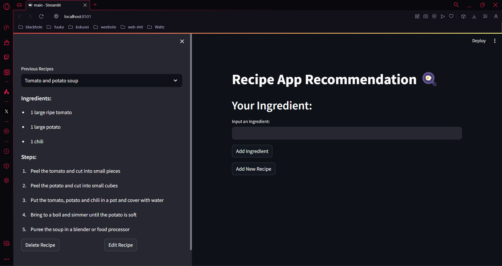

# Recipe Recommendation App
## Awang Fraditya - 5027221055

Ini adalah web recipe recommendation app yang berbasis python. Front-end dari website ini menggunakan library `streamlit` dan backend menggunakan `grpc` serta database `mongodb`. Dalam web ini pengguna dapat:

- Mendapatkan rekomendasi resep masakan sesuai dengan bahan - bahan yang telah diinput pengguna

- Mengupdate resep masaka sesuai keinginan pengguna

- Menghapus resep masakan

- Mendapatkan semua histori resep masakan

## How to run?

#### Prerequisites

- Python 3.11 

- install requirements.txt, `pip install -r requirements.txt`

- MongoDB installed

#### Server
1. `sudo systemctl start mongod` (Linux) atau start mongodb

2. `cd server`

3. `python main.py`

#### Client
1. `cd client`

2. `streamlit run main.py`

3. Akses di web browser `localhost:8501`

## Dokumentasi

Home page berisi *Add New Recipe* page dan *History* page

Kita bisa menginputkan bahan - bahan makanan sesuka kita

Hasil dari rekomendasi akan tampil di *History* page

## Transformers API

Dalam project ini API recipe recommendation yang digunakan adalah [**t5-recipe-recommendation**](https://huggingface.co/flax-community/t5-recipe-generation) oleh **flax-community**

## Demo Video

Video demo dapat diakses [disini](https://youtu.be/uOZFXOyS1ts)